A# Constraints and Table Alteration in SQL

This repository contains SQL scripts and screenshots demonstrating how to use constraints and the ALTER command in a database.

## Topics Covered:
* *Constraints:* NOT NULL, UNIQUE, PRIMARY KEY, CHECK, and DEFAULT.
* *Table Alteration:* Adding columns, dropping columns, and modifying data types using the ALTER statement.

## Screenshots:
I have attached screenshots of the output and the code execution for better understanding.
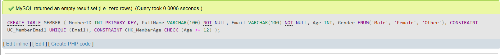.
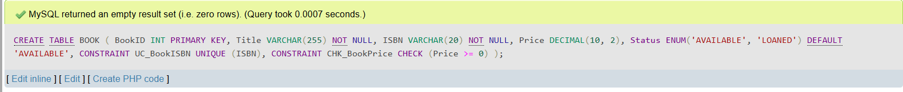.
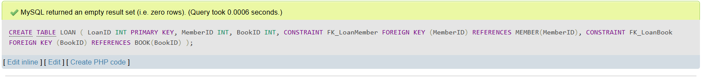.

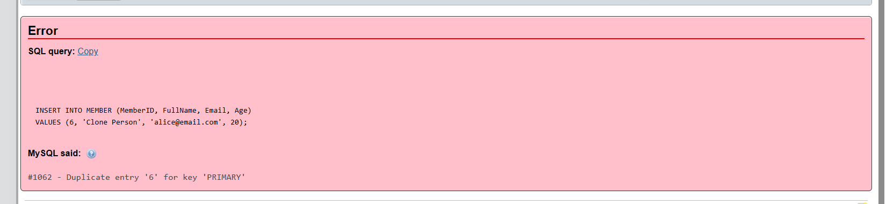.
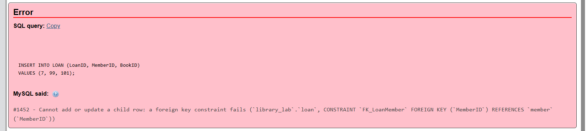.
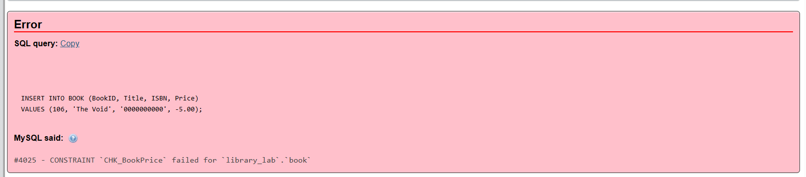.

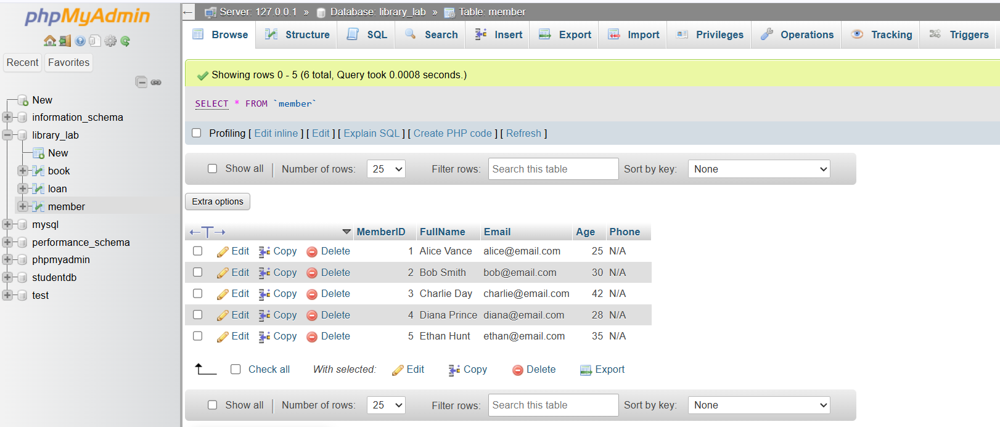.
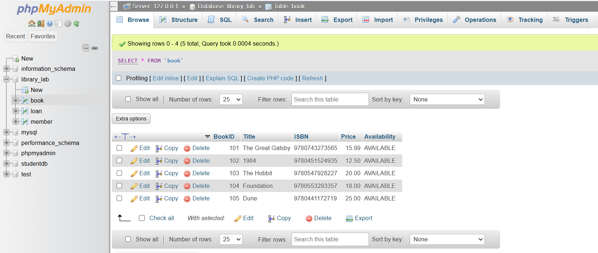.
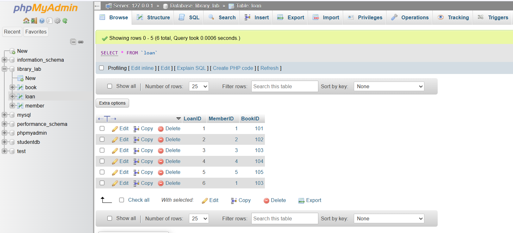.

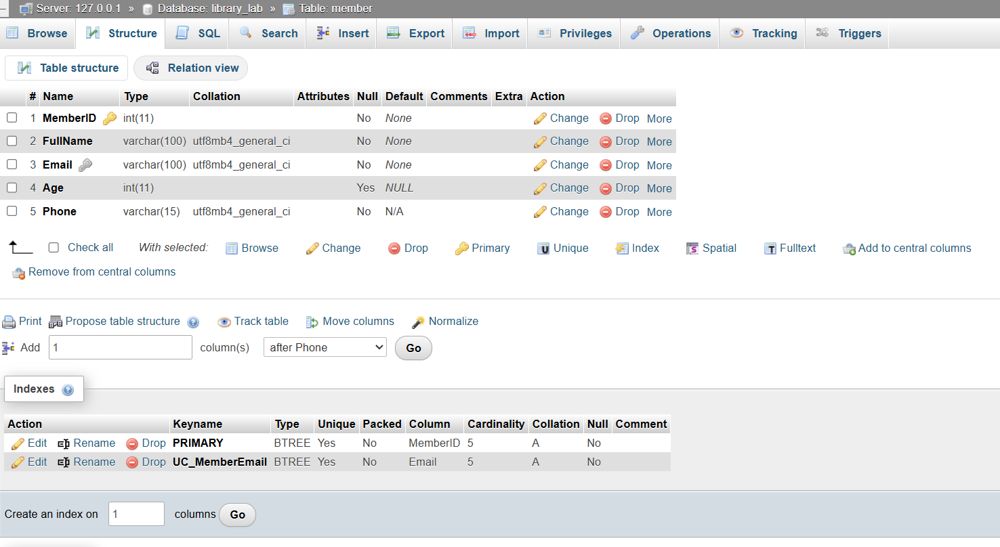.
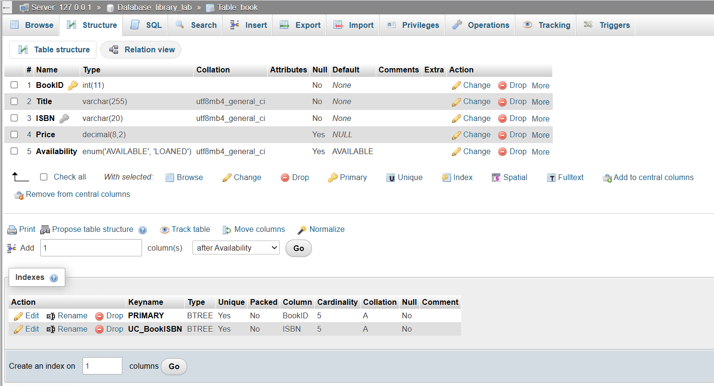.
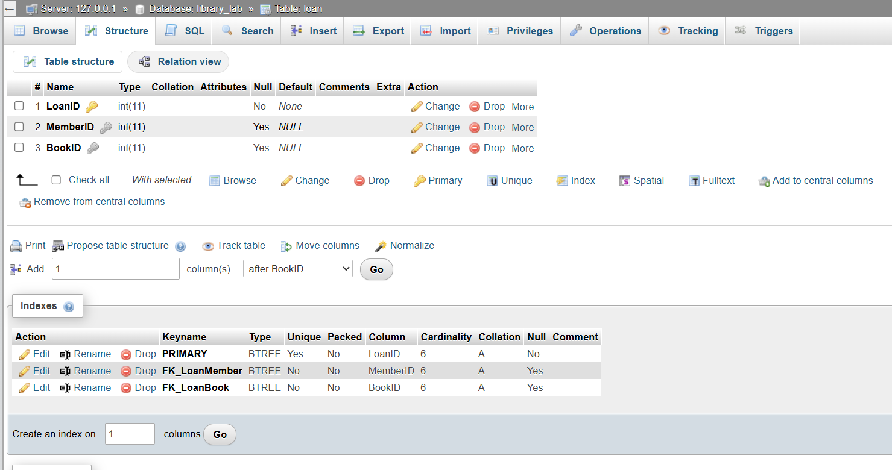.

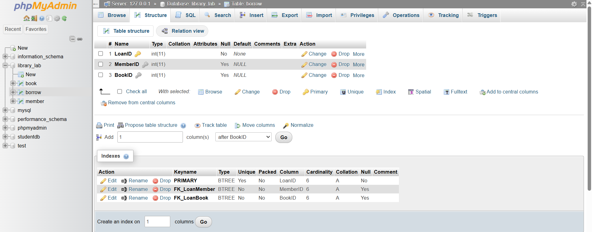.
